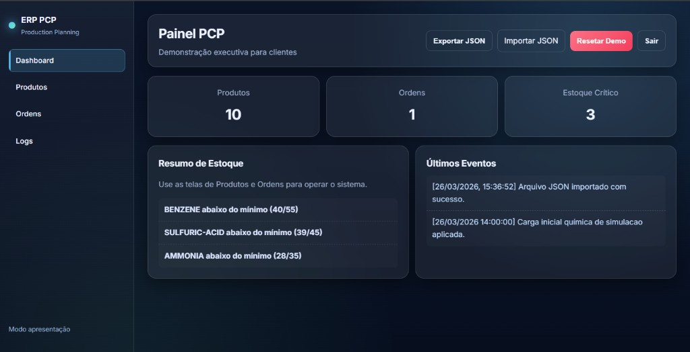

# ERP PCP CPP

Projeto de estudo em C++ para PCP (Planejamento e Controle da Producao), com foco na industria quimica, combinando:

- backend em C++17 com arquitetura em camadas
- painel web para demonstracao de fluxo operacional
- conceitos de seguranca, auditoria e rastreabilidade

## Visao geral

O sistema cobre um fluxo essencial de ERP/PCP:

- cadastro de produtos quimicos e propriedades
- criacao de ordens de producao com validacoes de estoque
- indicadores de painel (KPIs)
- registros operacionais para auditoria
- modelo extensivel para qualidade, inventario e producao

## Arquitetura da solucao

O backend segue separacao de responsabilidades inspirada em arquitetura limpa e principios SOLID:

- `src/domain`: entidades, enumeracoes, objetos de valor e servicos de dominio
- `src/application`: casos de uso e objetos de transferencia de dados
- `src/infrastructure`: repositorios, registros, integracoes e abstracao de banco
- `src/presentation/cli`: interface de linha de comando
- `src/security`: autenticacao (RBAC) e trilha de auditoria
- `src/shared`: utilitarios e excecoes compartilhadas
- `src/quality`, `src/production`, `src/inventory`: modulos reservados para expansao

## Modulos implementados

1. Formulacao quimica com historico de revisao (`ChemicalProduct`, `FormulaRevision`)
2. Rastreabilidade de lotes (`BatchLot`)
3. Integracao com API quimica (`ChemicalApiClient`)
4. Estrutura para relatorio FISPQ (`FispqService`)
5. Planejamento PCP/MRP com sugestao de compra (`CreateProductionOrderUseCase`)
6. Conversoes de inventario massa-volume (`InventoryService`)
7. Controle de acesso por perfil e auditoria (`AuthService`, `AuditLogger`)
8. Ciclo de vida de ordem (`ProductionOrder`, `BatchStatus`)
9. Motor de decisao de qualidade (`QualityService`, `QualityInspection`)
10. Servico de indicadores e painel (`DashboardService`)

## Estrutura do repositorio

```text
ERP_PCP_CPP/
|- controllers/
|- core/
|- data/
|- models/
|- repository/
|- services/
|- src/
|  |- application/
|  |- domain/
|  |- infrastructure/
|  |- presentation/
|  |- security/
|  `- shared/
|- ui/
|- utils/
`- main.cpp
```

## Requisitos

- compilador C++ com suporte a C++17 (g++, clang ou MSVC)
- Git
- navegador moderno para o painel web

## Compilacao e execucao (CLI)

No diretorio raiz do projeto:

```bash
g++ -std=c++17 main.cpp src/domain/entities/*.cpp src/domain/services/*.cpp src/application/usecases/*.cpp src/infrastructure/repositories/*.cpp src/infrastructure/api/*.cpp src/infrastructure/database/*.cpp src/infrastructure/logging/*.cpp src/security/auth/*.cpp src/security/audit/*.cpp src/presentation/cli/*.cpp -o erp_pcp_enterprise.exe
```

Depois:

```bash
./erp_pcp_enterprise.exe
```

## Painel web (UI)

A interface web esta em `ui/` com as paginas:

- `ui/login.html`
- `ui/index.html`
- `ui/produtos.html`
- `ui/ordens.html`
- `ui/logs.html`

Para melhor compatibilidade (PWA/service worker), execute com servidor local simples:

```bash
python -m http.server 5500
```

Depois abra:

- `http://localhost:5500/ui/login.html`

Credenciais de demonstracao:

- `admin` / `pcp123` (administrador)
- `engineer` / `pcp123` (engenharia)

## Seguranca

- autenticacao por perfis (RBAC) para operacoes sensiveis
- logs operacionais e auditoria para rastreabilidade
- base preparada para endurecimento futuro (tokens, hashing robusto, trilha ampliada)

## Estrategia de persistencia

`SQLiteReadyDatabase` fornece uma abstração pronta para evoluir para SQLite sem acoplamento da regra de negocio.

## Proximos passos

- [ ] persistencia completa em SQLite
- [ ] workflow de aprovacao de revisao de formula
- [ ] genealogia de lotes e rastreabilidade avancada
- [ ] integracao externa de risco/FISPQ
- [ ] API REST para o painel web
- [ ] pipeline CI/CD e testes automatizados

## Imagens do sistema

### Painel principal



## Licenca

Projeto de estudo para fins academicos e demonstracao tecnica.
